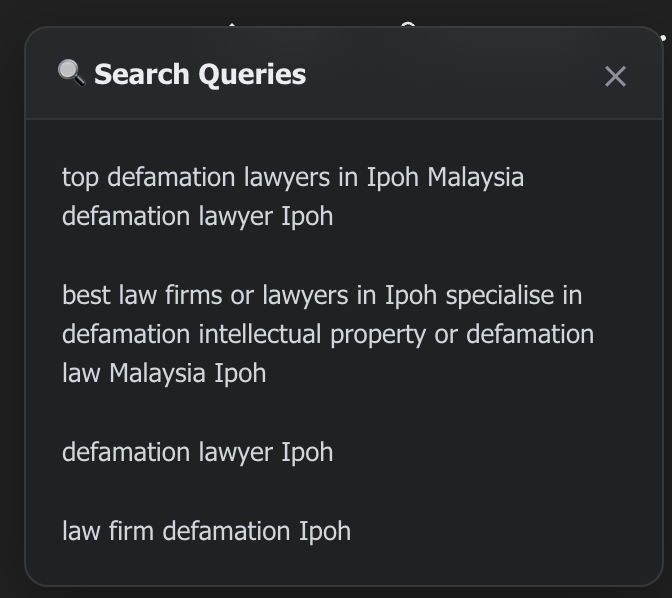
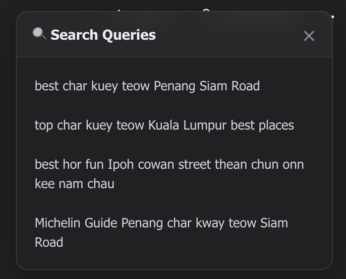

# ChatGPT Search Query Revealer

A Chrome Extension that unlocks the "Search" black box by displaying the exact keywords ChatGPT sends to search engines (Bing) directly in the UI.

**Created by Harinder Singh (@lightyoruichi) of MIMR Growth Lab (http://mimrgrowthlab.com/)**

## Problem Statement
When ChatGPT uses its "Browse" feature to answer a query (e.g., "best defamation lawyers in Ipoh"), it performs specific searches on Bing. These search queries are critical for SEO professionals and brands to understand how to rank for ChatGPT's answers.

Currently, this data is hidden. A user must manualy inspect network requests to find it. This extension automates that process.

## User Flow (PLG & UX)
1.  **Install**: No configuration required.
2.  **Use**: Ask ChatGPT something that requires browsing (e.g., "latest iphone rumors").
3.  **Reveal**: As soon as it searches, a premium glassmorphism overlay appears showing the exact queries used.

| Example 1 | Example 2 |
|:---:|:---:|
|  |  |

## Installation / Development

1.  Clone this repository.
2.  Open Chrome and navigate to `chrome://extensions/`.
3.  Enable "Developer mode" (top right).
4.  Click "Load unpacked".
5.  Select this directory (`chatgpt-search-revealer`).
6.  Go to [chatgpt.com](https://chatgpt.com) and test it out!

## Troubleshooting & Known Issues

- **Console Errors (`net::ERR_BLOCKED_BY_CLIENT`)**:
    - You may see red errors in the console pointing to `interceptor.js` for domains like `ab.chatgpt.com`.
    - **Cause**: These are tracking requests blocked by your ad-blocker.
    - **Note**: The extension safely passes these requests through, but because it wraps `fetch`, Chrome attributes the error to the extension. It is harmless.

- **Overlay not appearing**:
    - Ensure you are on `chatgpt.com`.
    - Check the console for `[ChatGPT Revealer]` logs.
